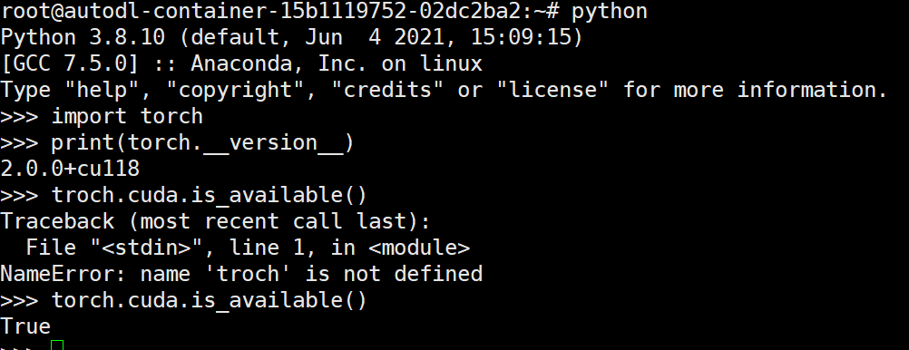
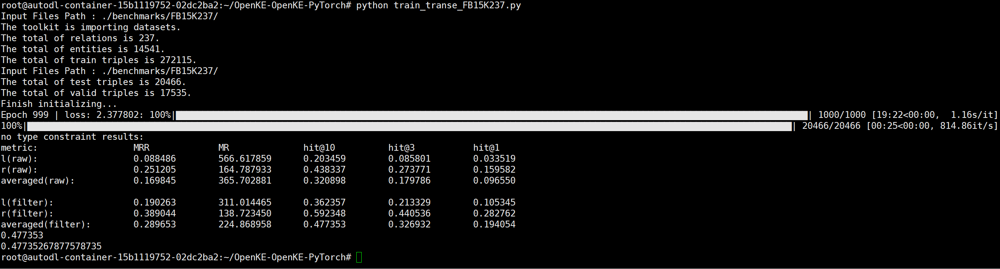

# Run-TransE-on-FB15K

## Summary
In windows environment, Run the TransE model on the FB15K data set

## The embedding principle of TransE
TransE model is a knowledge graph representation learning model based on vector space. Its embedded principle is to represent each entity and relation as a vector of fixed dimension, and constrain the relation between them to the addition operation in vector space. Specifically, for a triplet (h, r, t), where h, r and t respectively represent the head entity, relation and tail entity, the TransE model considers

  
```math
h+r≈t
```
that is, the vector of the head entity plus the relation vector in the vector space gets the vector of the tail entity.

In order to facilitate model calculation, TransE model defines some auxiliary functions and constraints. First, vector embedding of entities and relationships is constrained to the unit L2 norm, i.e., vector length of 1, to avoid model overfitting and further enhance generalization. Second, the inner product or cosine similarity can be used to calculate the similarity between vectors in order to evaluate the semantic correlation between entities and relationships. Finally, the negative sampling strategy is used to train the model, that is, to optimize the model on the negative example sample, resulting in non-existent triples (h, r, t') in the sampling process, where t' represents a false tail entity.

During the training process, the TransE model used MarginLoss loss functions to optimize the model and updated vector embedding by gradient descent algorithm. MarginLoss defines a hyperparameter interval, which can constrain the distance between positive and negative example samples, keeping a certain distance between them, so as to more accurately learn the semantic information of entities and relationships. By optimizing the differences between positive and negative examples, the TransE model can learn semantic information between entities and relationships, and obtain more efficient embedding vectors.

- The scoring function is defined as:

```math
E(h,r,t) = ||h+r-t||
```
> Among them, h, r and t represent the triples (head entities, relationships, tail entities) head entities, relationships, and the tail of the entity, ||·|| said vector Euclidean norm.

- The boundary-based loss function is defined as：

```math
L = ∑ ⟨h,r,t⟩∈T ∑ ⟨h',r',t'⟩∈T^- max([γ+E(h,r,t)-E(h',r',t')],0)
```
> Where, T represents the positive sample set, T^- represents the negative sample set, max(·,0) represents taking the non-negative part, and γ is the boundary hyperparameter.

> The boundary based loss function is used to minimize the distance between positive and negative samples in the embedding space, while keeping the difference between positive and negative samples within the boundary value γ>0

- Since there is no explicit negative sample triplet in the knowledge graph, the negative sample triplet T^- needs to be constructed as follows:

```math
T^- = {⟨h',r,t⟩|h'∈E} ∪ {⟨h,r',t⟩|r'∈R} ∪ {⟨h,r,t'⟩|t'∈E}
```

## Run-TransE-on-FB15K

### Preparation
- Compatible python + cuda + pytorch
- 这里巨坑，我走了太多弯路，这三个的版本必须严格匹配才能跑。最大的一个坑就是，python37 直接下torch默认下载的是给CPU用的，必须找给cuda用的，还得注意这三个的版本严格兼容。最后我是去网上一元钱租了一个GPU做的，网上租的GPU这三个都是适配好的。
- 我用的是python38 + cuda11.8 + pytorch2.0.0

### Check the environment

- Import pytorch, Type in the terminal:

```
python
import torch
```
- Check out the version of torch

```
print(torch.__version__)
```
> The version number returned here if "+cpu" is present there is an error, it should be "+cu"
- Check whether torch is compatible with cuda

```
troch.cuda.is_available()
```
> If True is returned, proceed

```
exit()
```


### Quick start

- Download OpenKE source code

```
git clone https://github.com/thunlp/OpenKE.git
```
- Go to the openke directory

```
cd OpenKE
cd openke
```
- Compiling C++ files

```
bash make.sh
```
- Go to superior directory

```
cd ../
```
- Create the directory "checkpoint"

```
mkdir checkpoint
```
### Training
- Run the TransE model on the FB15K data set

```
cp examples/train_transe_FB15K237.py ./
python train_transe_FB15K237.py
```
- Some dependency packages may need to be installed during the process. Install them with pip as prompted, such as:

```
pip install scikit-learn
```
- Run successfully


- Data analysis
> The training results showed that the averaged performance of averaged representation of knowledge graph using TransE model was lower on MRR, MR And hit@1-10. Compared with unfiltered data, the filtered data results improve performance, especially in the l(filter) and r(filter) directions. This indicates that the negative sampling strategy can effectively reduce the noise in the training data, improve the accuracy of the model, and alleviate the collision between entities and relations.

> hit@10 is one of the indicators used to measure the accuracy of the model's recommended entities, and it represents the ratio of at least one of the top 10 entities in the recommended list to be correct. Therefore, when the model's hit@10 indicator is 0.477, it means that in each triplet, the model is able to correctly recommend about half of the top 10 entities (i.e. the correct entity and the recommended entity have a close agreement of about 50%). This indicates that the accuracy of the model for the top10 recommended entities is relatively high, but there is still room for further optimization.

- Other models can be trained with similar commands

